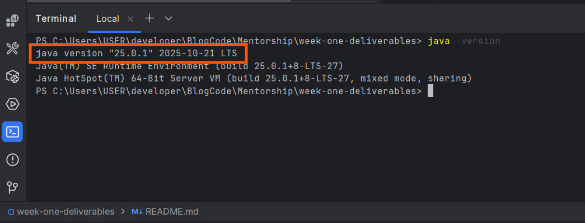

# Week 1 – Java Basics

## Topics Covered
- Java setup & tooling
- Variables and data types
- Console input/output
- Conditional statements

## Mini Project
Personal Info Collector CLI app that:
- Accepts name and age
- Validates input
- Prints formatted output

## Deliverables
1️⃣ Environment & Setup (Mon) — Proof of Setup

- JDK installed (Java 17 or later)
- IDE installed (IntelliJ IDEA or VS Code)
- Git installed and configured
- GitHub account created
- GitHub repository created
- README file created in the repository

## Final Week 1 Completion Checklist
✔ Java runs on your machine  
✔ GitHub repo exists and is public  
✔ All `.java` files compile  
✔ Mini project works with validation  
✔ README explains your work
✔ GitHub repo URL (e.g. java-learning-week1)